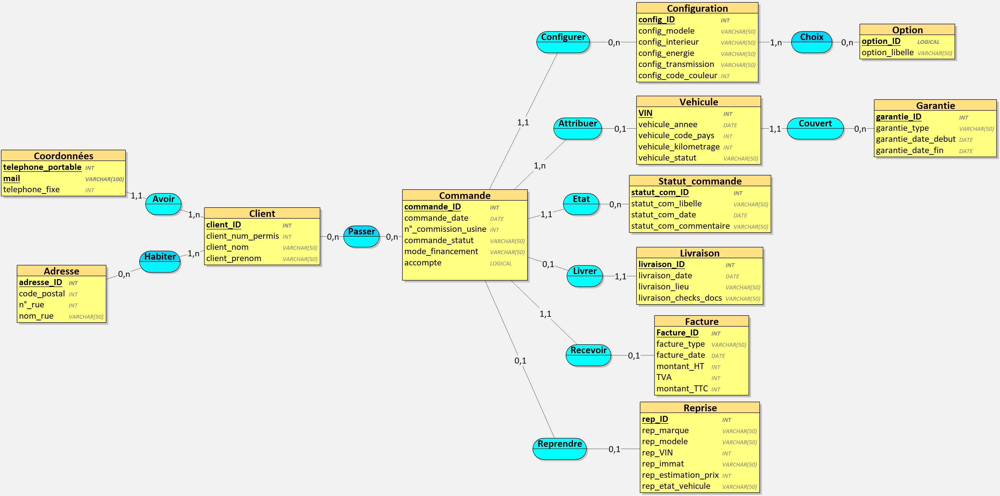

MINI-PROJET MERISE — PARTIE 1 (Configuration & Achat)

Centre Porsche — Rapport

	1.	Objectif
Concevoir le système d’information d’un Centre Porsche, limité à la configuration et à l’achat d’un véhicule : commande et options codées, suivi des statuts, attribution du VIN, livraison, financement, reprise, facturation. Le SAV (atelier, pièces, entretiens) est hors périmètre pour cette partie.

	2.	Périmètre
IN : configuration véhicule, commande, codes options, statuts (allocation / production / transit / livré), VIN et livraison, financement (comptant / crédit / LOA / LLD), reprise, facture de vente.
OUT : après-vente/SAV, services connectés, gestion de stock de pièces.

	3.	Méthode (IAG)
Nous avons rédigé un prompt précis pour obtenir :
– des règles de gestion en langage métier (non technique) ;
– un dictionnaire de données brutes (25–35 éléments : signification, type, taille).
À partir de ces éléments, le MCD est réalisé avec un outil de modélisation (image à insérer à la fin du README ; fichier source déposé dans le dépôt).

	4.	Prompt final (à l’identique)
Tu travailles dans le domaine de l’automobile premium, spécialisé Porsche.
Ton entreprise a comme activité de Centre Porsche franchisé en France : configuration et achat de véhicules (neufs et d’occasion labellisés Porsche Approved), suivi de commande et de production, livraison, gestion des reprises et facturation. (Hors périmètre : après-vente/atelier/entretien.)
C’est une entreprise comme Centre Porsche Paris, Centre Porsche Lyon, Centre Porsche Bordeaux (réseau officiel Porsche).
Informations utiles à mettre dans la base : identification des clients et prospects, commandes configurées (numéro de commission usine, modèle, type interne Porsche 992/971/9Y0…, énergie, transmission, couleurs), liste codifiée d’options (codes usine) liée à chaque configuration, suivi des statuts de la commande (allocation, production, transit, livré), attribution du véhicule physique par VIN (17 caractères) puis enregistrement de la livraison (lieu/date/documents), modalités de financement (comptant/crédit/LOA/LLD), reprise éventuelle d’un véhicule, et facturation finale.
Inspire-toi du site web suivant : pages officielles Porsche France (Garantie véhicule neuf, Porsche Approved) et référentiels publics de codes d’options Porsche.

Ton entreprise veut appliquer MERISE pour concevoir un système d’information. Tu es chargé de la partie analyse, c’est-à-dire de collecter les besoins auprès de l’entreprise. Elle a fait appel à un étudiant en ingénierie informatique pour réaliser ce projet, tu dois lui fournir les informations nécessaires pour qu’il applique ensuite lui-même les étapes suivantes de conception et développement de la base de données.

D’abord, établis les règles de gestions des données de ton entreprise, sous la forme d’une liste à puce. Elle doit correspondre aux informations que fournit quelqu’un qui connaît le fonctionnement de l’entreprise, mais pas comment se construit un système d’informations.

Ensuite, à partir de ces règles, fournis un dictionnaire de données brutes avec les colonnes suivantes, regroupées dans un tableau : signification de la donnée, type, taille en nombre de caractères ou de chiffres. Il doit y avoir entre 25 et 35 données. Il sert à fournir des informations supplémentaires sur chaque données (taille et type) mais sans a priori sur comment les données vont être modélisées ensuite.

Fournis donc les règles de gestion et le dictionnaire de données.

	5.	Sortie — Règles de gestion (métier)
– Un client est identifié par un identifiant interne ; un même client peut passer plusieurs commandes.
– Chaque commande est associée à un et un seul client et porte une configuration figée (modèle, type interne, énergie, transmission, teintes).
– Les options d’une configuration sont codifiées via des codes usine Porsche ; une configuration peut comporter plusieurs options.
– Le numéro de commission (usine) identifie la commande côté production ; l’évolution de la commande est suivie par statuts (allocation, production, transit, livré) avec date et commentaire.
– L’attribution du véhicule physique à une commande se fait par le VIN (17 caractères), unique ; sans VIN attribué, la commande ne peut pas être livrée.
– La livraison enregistre la date, le lieu et la complétude des documents remis au client.
– Le financement est saisi (comptant, crédit, LOA, LLD) ; un acompte peut être enregistré ; le prix total TTC = prix de base + options.
– Une reprise (trade-in) peut être liée à la commande avec indication d’une estimation de valeur.
– La facturation de vente est émise à la livraison avec le montant TTC.
– Contraintes de qualité : VIN unique (17 caractères), codes options conformes au référentiel, cohérence des montants, chronologie des dates (statuts, livraison).

	6.	Sortie — Dictionnaire de données brutes (35 éléments)
(Colonne 1 : Signification — Colonne 2 : Type — Colonne 3 : Taille)

	1.	Client_ID — Numérique entier — 9 chiffres
	2.	Client_Nom — Texte — 50
	3.	Client_Prenom — Texte — 50
	4.	Client_Email — Texte (email) — 100
	5.	Client_Telephone — Texte (numéro) — 15
	6.	Client_Adresse — Texte (voie + CP + ville) — 180
	7.	Client_ConsentementMarketing — Enum (oui/non) — 5
	8.	Commande_ID — Numérique entier — 9 chiffres
	9.	Commande_Date — Date — —
	10.	Commande_NumCommission — Texte — 12
	11.	Commande_ModeFinancement — Enum (comptant/credit/LOA/LLD) — 10
	12.	Commande_Acompte — Décimal — 10,2
	13.	Commande_PrixBaseTTC — Décimal — 12,2
	14.	Commande_PrixTotalTTC — Décimal — 12,2
	15.	Configuration_ID — Numérique entier — 9 chiffres
	16.	Modele_Commercial — Texte — 60
	17.	Type_Interne — Texte — 6
	18.	Energie — Enum (essence/hybride/électrique) — 12
	19.	Transmission — Enum (BVM/PDK/AT) — 12
	20.	CouleurExt_Code — Texte — 8
	21.	CouleurInt_Code — Texte — 8
	22.	Option_Code — Texte (code usine) — 6
	23.	Option_Libelle — Texte — 100
	24.	ConfigOption_Quantite — Numérique entier — 2 chiffres
	25.	ConfigOption_PrixUnitaireTTC — Décimal — 10,2
	26.	Vehicule_VIN — Texte (numéro de série) — 17
	27.	Livraison_ID — Numérique entier — 9 chiffres
	28.	Livraison_Date — Date — —
	29.	Livraison_Lieu — Texte — 60
	30.	Statut_Libelle — Texte — 20
	31.	Statut_Date — Date — —
	32.	Statut_Commentaire — Texte — 200
	33.	Facture_ID — Numérique entier — 9 chiffres
	34.	Facture_MontantTTC — Décimal — 12,2
	35.	Reprise_Estimation — Décimal — 12,2

Notes d’application
– VIN : 17 caractères, unicité forte ; ne pas tronquer.
– Les codes d’option sont conservés tels quels (ex. “0Q”, “1N3”, “G1D”).
– Les statuts sont historisés via un couple (Statut_Libelle, Statut_Date) ; Statut_Commentaire est facultatif.
– Les montants sont en euros ; 2 décimales.
– Les tailles ci-dessus guident la saisie sans présumer des clés ou de la structure finale (modélisation à l’étape MCD/MLD).
	7.	MCD (à insérer après ce rapport)
L’image du MCD correspondant (entités/associations/cardinalités) sera ajoutée ici. Le fichier source du MCD (outil de modélisation) est déposé dans le dépôt.
	8.	Contenu du dépôt (rappel)
– Ce rapport (prompt + règles + dictionnaire).
– L’image du MCD et le fichier source du modeleur.

